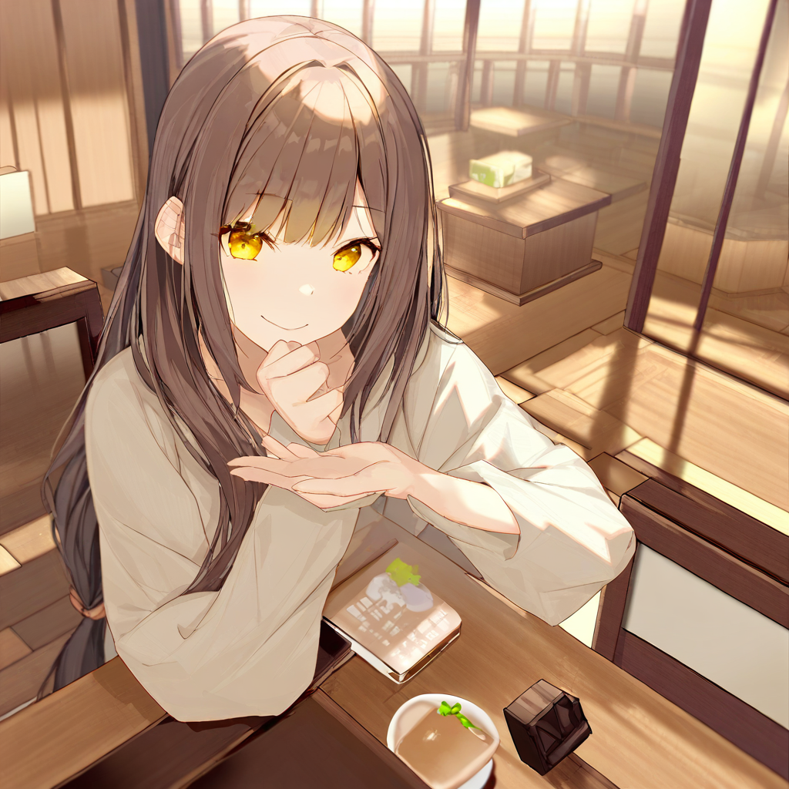
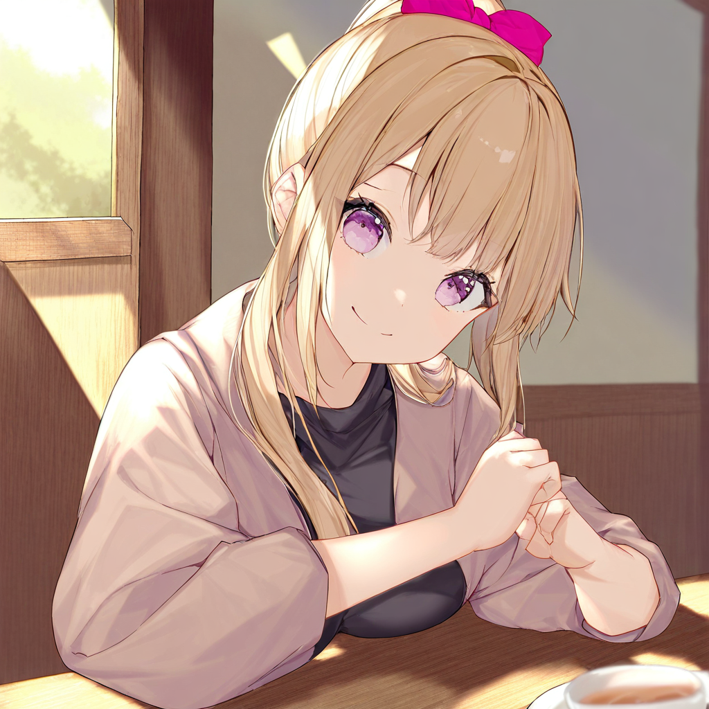
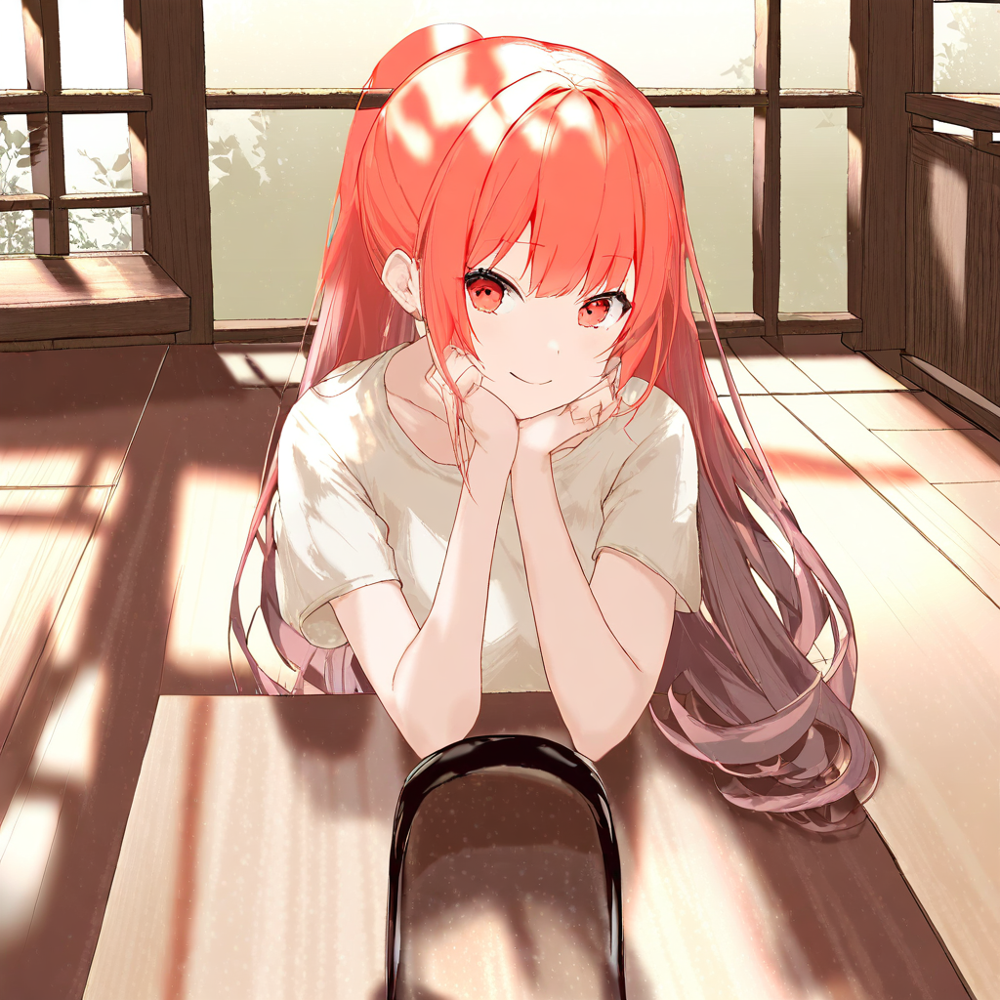
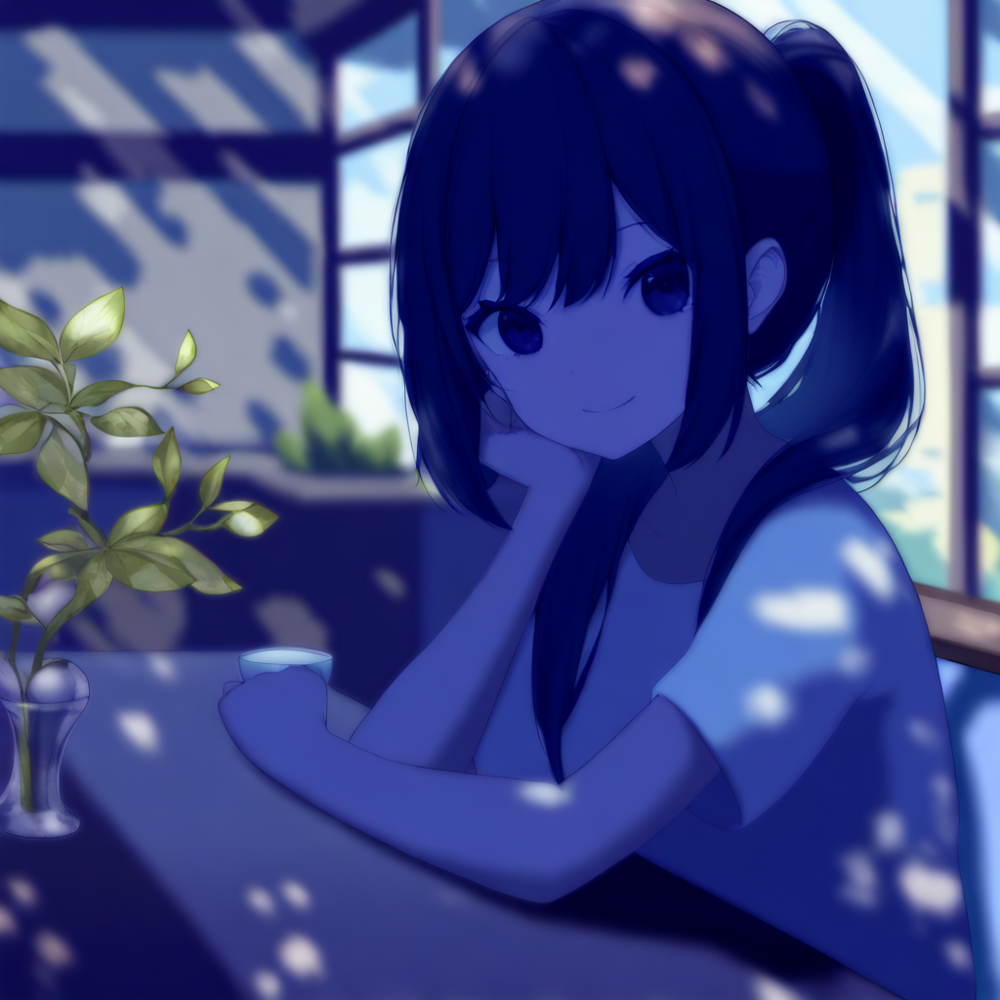

# Color Forcing
When generating an image from a textual prompt via a diffusion model, one can obviously modulate the general color of certain features by simply attaching the name of the color to the feature in the prompt: "red", "green", "gold", etc.

We attempt to refine this, so that the user can choose a substring of the prompt to assign a precise RGB value, which is then near-exactly reproduced in the generated image.

Our results are mixed; it works quite well for smaller features (particularly eyes), but often breaks down for features that take up more of the image (or at least needs heavy parameter tweaking and some luck to get anything remotely passable). This is much more due to the difficulty of getting a good saliency map mid-generation than it is to the color modification process.

(I initially was going to use stabilityai/stable-diffusion-xl-base-1.0, but I wasn't getting consistently good saliency maps from it. So I switched to its fine-tune cagliostrolab/animagine-xl-4.0 and started getting much better results. I suspect being fine-tuned on tag-based prompts is the big help.)

## How It Works
There are essentially two pieces to this process: the first is the generation of a "gold latent" which represents the precise color, combined with a simple biasing of the U-Net's predicted noise to favor the direction of that latent. The second is the construction of a saliency map for each step during generation, which is the area over which the biasing will be applied, so that only the relevant parts of the image get colored.

The construction of the gold latent is simple: we generate a solid block of the color the same size as the image to be generated and then pass that block through the VAE to get our gold. This gold has the benefit of being nearly invariant in the dimensional directions (modulo edge effects), so biasing towards it will work at any location in the image. We treat this gold latent as a fixed "predicted color mean", $ \mu_c $.

We then begin the image generation process. Each step, the U-Net outputs a predicted noise $ \epsilon $, which gets transformed into a predicted mean $ \mu $ which is the mean of a Gaussian (which has variance $ \sigma^2 $ that depends on the timestep) from which a sample is chosen to become the new latent. The idea is to modify this $ \mu $ as follows:
$$ \mu\mapsto\frac{\sigma_c^2\mu+\sigma^2\mu_c}{\sigma^2+\sigma_c^2}, $$
where $ \sigma_c^2 $ is a pre-chosen constant representing the "inverse strength" of the color biasing; large $ \sigma_c^2 $ will loosen the modification, while small (near-zero) $ \sigma_c^2 $ will strongly bias towards a solid block of color.

The motivation for this formula is that it's the mean of a "product of experts" between Gaussians $ (\mu, \sigma) $ and $ (\mu_c, \sigma_c) $; this has the desirable property that it skews the mean towards whichever Gaussian has the lower variance. This means that for early timesteps when $ \sigma $ is large, the bias will favor the pure color, while for late timesteps when $ \sigma $ is small, the generation can focus on detail touch-ups with the raw color being only a gentle bias. In this way, the biasing works over the full duration of the generation.

The second piece is the saliency map, which is a mask in the shape of the dimensional part of the latent (i.e. height//8, width//8) that shows where in the latent the chosen substring "is". The primary method of determining saliency will be via [DAAM](https://arxiv.org/abs/2210.04885), which enters each cross-attention in each U-Net pass and keeps track of which image latent tokens adhere best to the tokens in the chosen sub-prompt.

We also offer a second saliency option (the `use_alt_saliency` parameter) using a prompt differential method. Here we just add the string "pink " to immediately before the desired substring, run it through the U-Net along with the initial prompt, and augment the saliency by the difference between the predicted noises of the modified and unmodified prompts. I chose "pink" because few things are naturally pink, but one could use any color really. This has the downside of needing to run through the U-Net a full extra time, and so requires more significant overhead, but works better in some cases.

## Usage Tips
- The `color_var` parameter should never really go below 15 or 20; it can go as high as 70-ish and still get good results.
- The `saliency_cutoff` parameter determines the cutoff that makes each saliency tensor (with float entries) into a proper saliency mask (with 0/1 entries). This can differ pretty wildly for different sub-prompts, but generally needs to be smaller for "bigger" regions and can be larger for more focused regions; generally it'll range from about .1 to .3.
- To add, as explained before, the `use_alt_saliency` parameter will add more values to the saliency mask, and hence generally requires a larger `saliency_cutoff`. 
- To help with this, we display the saliency map at each inference step before displaying the final image. You can then see how well the saliency map is working, and what a good `saliency_cutoff` might be.
- We also include `max_timestep` and `min_timestep` parameters, with default values 700 and 0, respectively. These give the interval over which the image is to be modified. As explained in "How it Works", the color biasing should work reasonably well over the entire range, but the saliency map might benefit from some tweaking here. For example, we start at 700 rather than 1000 because saliency is less defined when the image is mostly noise.
- There's going to be trial-and-error with parameter tuning. Even with all parameters identical, sometimes it's spot on, sometimes it's way off. Luck of the draw.

## Examples
I'll start with the big success: this works beautifully for eyes. Here I've generated a character with bright gold eyes: RGB 255, 215, 0. My inputs were:
```
prompt = "1girl, hair in ponytail, eyes, looking at viewer, smile, sitting at a table indoors with breakfast in front of her, masterpiece, high score, great score, absurdres"
colored_prompt = "eyes"
color = [255, 215, 0]
negative_prompt = "lowres, bad anatomy, bad hands, text, error, missing finger, extra digits, fewer digits, cropped, worst quality, low quality, low score, bad score, average score, signature, watermark, username, blurry"
generate_colored_image(pipe, prompt, colored_prompt, color, negative_prompt, color_var=40, use_alt_saliency=False, saliency_cutoff=.15)
```

Do note that nowhere in the prompt do I actually ask for the eyes to be gold.

I've found that, like I suggested before, the more prominent the object is in the image, the more one has to finagle `color_var` and `saliency_cutoff`. Here's another good example, this time making a hair bow that's bright pink: RGB 255, 105, 180. Note that "hair bow" is multiple tokens, so we can verify that works.
```
prompt = "1girl, hair in ponytail, hair bow, looking at viewer, smile, sitting at a table indoors with breakfast in front of her, masterpiece, high score, great score, absurdres"
colored_prompt = "hair bow"
color = [255, 105, 180]
negative_prompt = "lowres, bad anatomy, bad hands, text, error, missing finger, extra digits, fewer digits, cropped, worst quality, low quality, low score, bad score, average score, signature, watermark, username, blurry"
generate_colored_image(pipe, prompt, colored_prompt, color, negative_prompt, color_var=15, use_alt_saliency=False, saliency_cutoff=.17)
```

Let's get a little bigger: let's try making the entire hair a tomato red: RGB 255 99 71. Since the hair will take up a larger proportion of the image, we'll need to tune `saliency_cutoff` down a bit, which puts us at a larger risk of bleed-over. To follow my own advice, we'll use `use_alt_saliency=True`, and hence also a larger `saliency_cutoff`.
```
prompt = "1girl, hair in ponytail, looking at viewer, smile, sitting at a table indoors with breakfast in front of her, masterpiece, high score, great score, absurdres"
colored_prompt = "hair"
color = [255, 99, 71]
negative_prompt = "lowres, bad anatomy, bad hands, text, error, missing finger, extra digits, fewer digits, cropped, worst quality, low quality, low score, bad score, average score, signature, watermark, username, blurry"
generate_colored_image(pipe, prompt, colored_prompt, color, negative_prompt, color_var=25, use_alt_saliency=True, saliency_cutoff=.20)
```

It's not bad, but you can see that the color has bled over into the eyes. That's a persistent problem with doing this color forcing around the face: eyes in particular seem to be very easy to change the color of, even if you don't want them to.

For the final example, let's be a little ambitious: let's try giving the character dark blue skin like Avatar. For this we'll certainly need `use_alt_saliency=True`, as just "skin" is probably too general a concept for DAAM to detect.
```
prompt = "1girl, hair in ponytail, looking at viewer, skin, smile, sitting at a table indoors with breakfast in front of her, masterpiece, high score, great score, absurdres"
colored_prompt = "skin"
color = [0, 0, 139]
negative_prompt = "lowres, bad anatomy, bad hands, text, error, missing finger, extra digits, fewer digits, cropped, worst quality, low quality, low score, bad score, average score, signature, watermark, username, blurry"
generate_colored_image(pipe, prompt, colored_prompt, color, negative_prompt, color_var=20, use_alt_saliency=True, saliency_cutoff=.12)
```

And here we start heavily running up against the limitations of our saliency detection: these methods just aren't fine enough to separate out *just* the skin. Notice how low we had to make `saliency_cutoff` as well; very low for `use_alt_saliency`, because the skin is such a major feature of the image.

As a final word, do note that I've cherry-picked these examples quite heavily. That's not to say I'm trying to make this seem better than it is, but, well, there's a lot of trial-and-error with parameter tweaking, and it's hard to represent that; some of these images took probably over 10 retries to get good parameters and a decent-looking image. So like I said initially, a bit of a mixed bag.